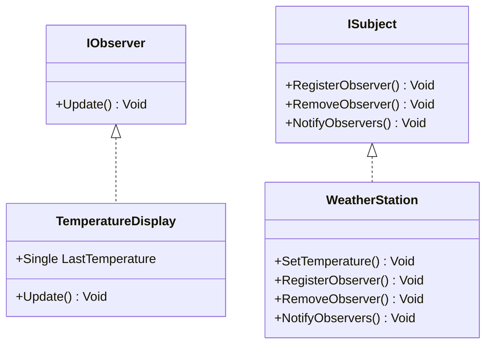

# 🧠 Patrón de Diseño de Comportamiento: Observer

Este proyecto demuestra el uso del patrón **Observer** (Observador), uno de los patrones de comportamiento, aplicado en una estación meteorológica que notifica a sus observadores cada vez que cambia la temperatura.

---

## 🛠 Paso a paso del desarrollo

### 1. Crear la solución y proyectos necesarios

Se ejecutaron los siguientes comandos para crear la solución y sus respectivos proyectos:

```bash
dotnet new sln -o Comportamiento
cd Comportamiento
dotnet new classlib -o Comportamiento.Domain
dotnet sln add ./Comportamiento.Domain/Comportamiento.Domain.csproj
dotnet new nunit -o Comportamiento.Domain.Tests
dotnet sln add ./Comportamiento.Domain.Tests/Comportamiento.Domain.Tests.csproj
dotnet add ./Comportamiento.Domain.Tests/Comportamiento.Domain.Tests.csproj reference ./Comportamiento.Domain/Comportamiento.Domain.csproj
```
### 2. Estructura del patrón Observer

ISubject: interfaz que define los métodos RegisterObserver, RemoveObserver y NotifyObservers.

IObserver: interfaz que define el método Update.

WeatherStation: clase concreta que implementa ISubject y representa una estación que notifica cambios de temperatura.

TemperatureDisplay: clase concreta que implementa IObserver y muestra la temperatura actual.

### 3. Pruebas
Se implementaron pruebas unitarias en Comportamiento.Domain.Tests utilizando NUnit. Estas verifican que los observadores reciban notificaciones correctamente y que dejen de recibirlas al ser eliminados del sujeto.


### 4. Diagrama generado con dll2mmd
Se generó el siguiente diagrama UML en código Mermaid utilizando el comando:

```bash
dll2mmd -f Comportamiento.Domain/bin/Debug/net8.0/Comportamiento.Domain.dll -o comportamiento.

```



### Conclusión
Este laboratorio demuestra la utilidad del patrón Observer para implementar sistemas desacoplados donde los objetos pueden recibir actualizaciones en tiempo real sobre cambios en otros objetos. El código y las pruebas muestran cómo este patrón facilita la comunicación entre componentes sin depender directamente entre sí.